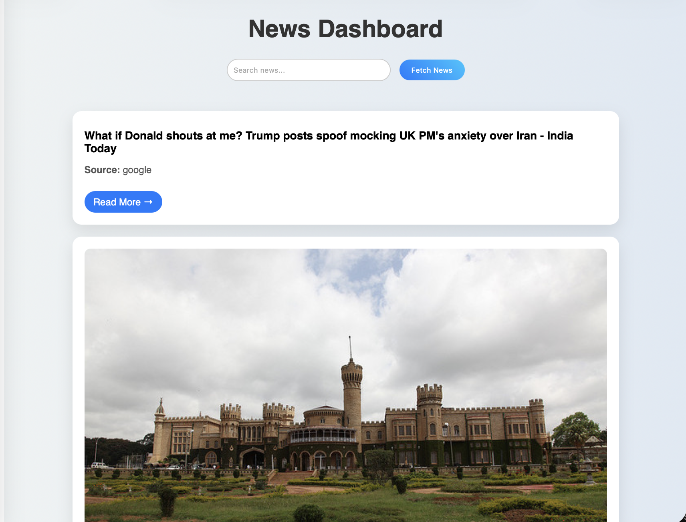

# Dockerized News Portal

## Overview

Dockerized News Portal is a responsive web application that fetches and displays real-time news articles using the NewsData.io API. The application allows users to search for news topics, view articles in a modern interface, and access the latest updates dynamically. The project is containerized using Docker for easy deployment and portability.

---

## Live Demo

🔗 https://news-dashboard-three-pi.vercel.app/

---

## Features

- Search news articles by keyword
- Fetch real-time news using NewsData.io API
- Display articles with images and source information
- Responsive and modern user interface
- Dynamic content loading using JavaScript
- Error handling for failed API requests
- Dockerized deployment for portability and consistency

---

## Tech Stack

- HTML5
- CSS3
- JavaScript (ES6+)
- REST API
- Docker
- Nginx
- NewsData.io API

---

## Project Structure

```text
dockerized-news-portal/
├── index.html
├── style.css
├── script.js
├── Dockerfile
├── README.md
└── screenshots/
    └── dashboard.png
```

---

## Installation & Setup

### Clone the Repository

```bash
git clone https://github.com/your-username/dockerized-news-portal.git

cd dockerized-news-portal
```

### Run Locally

Open `index.html` in your browser or use Live Server.

---

## Docker Setup

### Build Docker Image

```bash
docker build -t dockerized-news-portal .
```

### Run Docker Container

```bash
docker run -d -p 8080:80 --name news-portal dockerized-news-portal
```

### Access Application

```text
http://localhost:8080
```

### Stop Container

```bash
docker stop news-portal
```

### Remove Container

```bash
docker rm news-portal
```

---

## Usage

1. Enter a keyword in the search box.
2. Click **Fetch News**.
3. Browse the latest news articles.
4. Open articles using the **Read More** button.

---

## Screenshots



---

## API Used

### NewsData.io API

```text
https://newsdata.io/api/1/latest
```

Sample Request:

```javascript
https://newsdata.io/api/1/latest?apikey=YOUR_API_KEY&q=india&language=en
```

---

## Challenges Solved

- API integration using Fetch API
- Asynchronous programming with async/await
- Handling empty API responses
- Managing missing article images
- Error handling and debugging
- Containerizing a frontend application using Docker

---

## What I Learned

- Working with REST APIs
- Processing JSON responses
- DOM manipulation using JavaScript
- Building responsive user interfaces
- Docker image creation and container management
- Deploying web applications efficiently
- Debugging API and CORS-related issues

---

## Backend (New)

This project now has a full Express + MongoDB backend in `/backend` that adds:

- Signup / login with JWT authentication and bcrypt-hashed passwords
- Per-user bookmarks (save/unsave news articles)
- A `/api/news` proxy so the NewsData.io API key lives server-side, not in frontend JS

See `backend/README.md` for setup and deployment instructions (MongoDB Atlas + Render/Railway).

Quick start:

```bash
cd backend
cp .env.example .env   # fill in MONGO_URI and JWT_SECRET
npm install
npm run dev
```

Then open `index.html` (e.g. via Live Server) — it talks to `http://localhost:5000/api` by default.

## Future Enhancements

- Category-based news filtering
- Dark mode support
- Pagination and infinite scrolling
- Bookmark favorite articles
- Multi-language support
- Backend integration for secure API key storage
- User authentication and personalization

---

## Resume Impact

- Developed a real-time news portal using JavaScript and REST APIs to fetch and display dynamic news content.
- Containerized the application using Docker and Nginx, enabling portable deployment and consistent execution across environments.
- Implemented responsive UI design, API integration, and error handling to improve user experience.

---

## Author

**Tanya Singh**

B.Tech Computer Science & Engineering

- GitHub: https://github.com/your-github-username
- LinkedIn: https://linkedin.com/in/your-linkedin-id
